# UML Diagrams - Ngọa Long Tam Quốc

## 1. Class Diagram - Core Domain

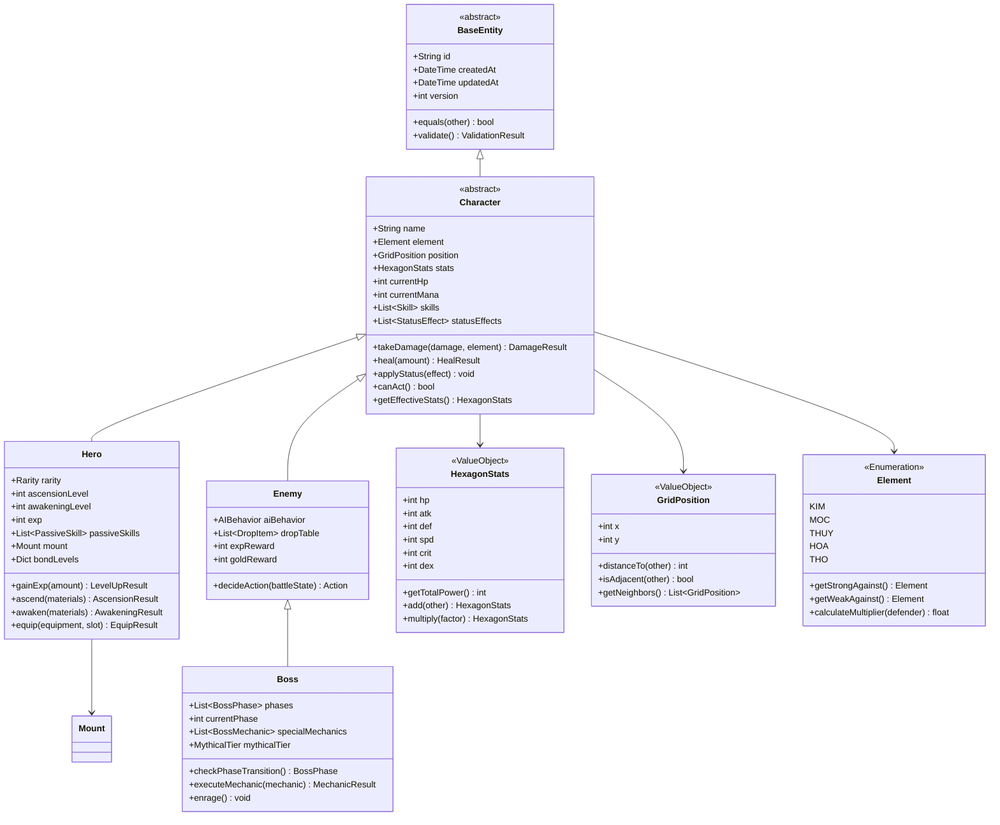

## 2. Class Diagram - Skill System

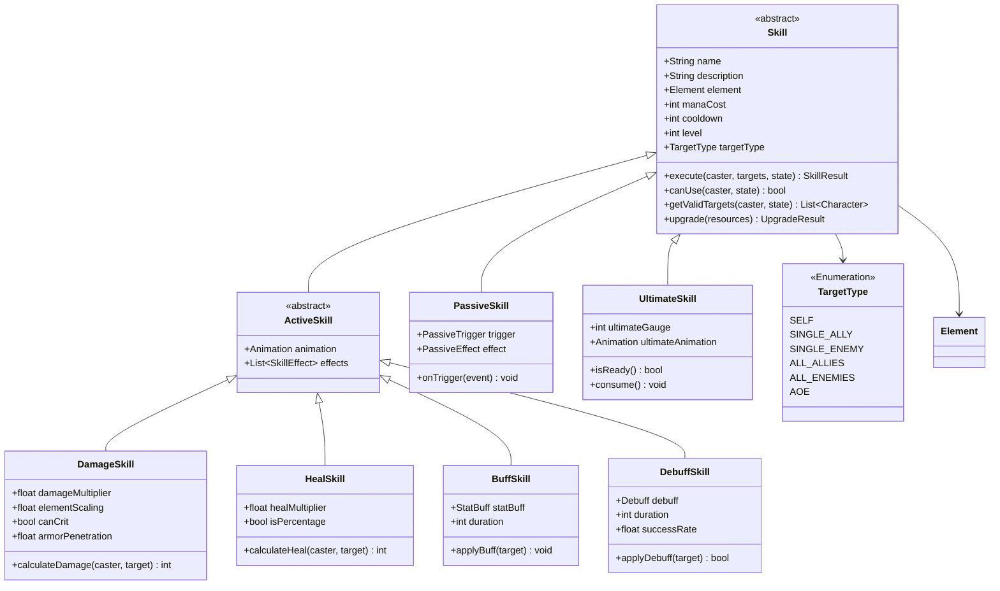

## 3. Class Diagram - Equipment System

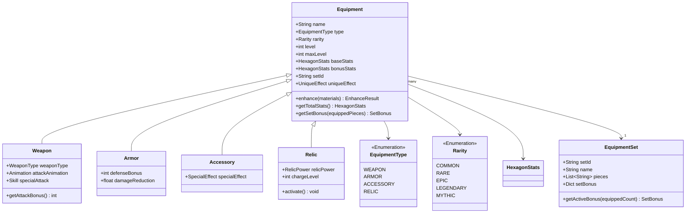

## 4. Class Diagram - Battle System

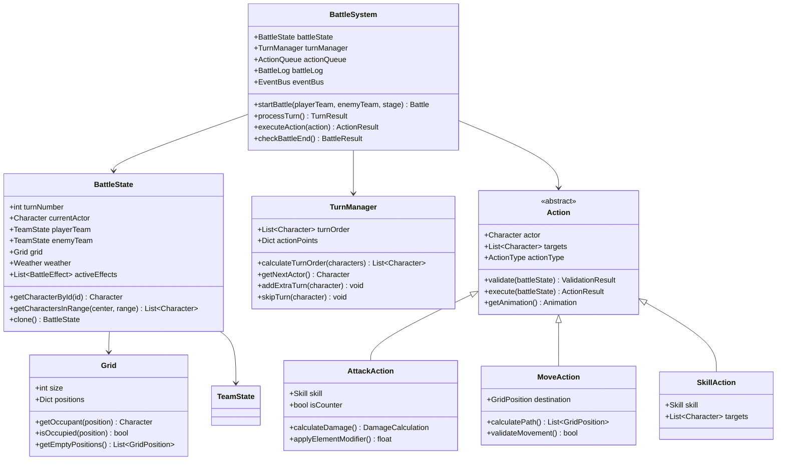

## 5. Class Diagram - Mount System

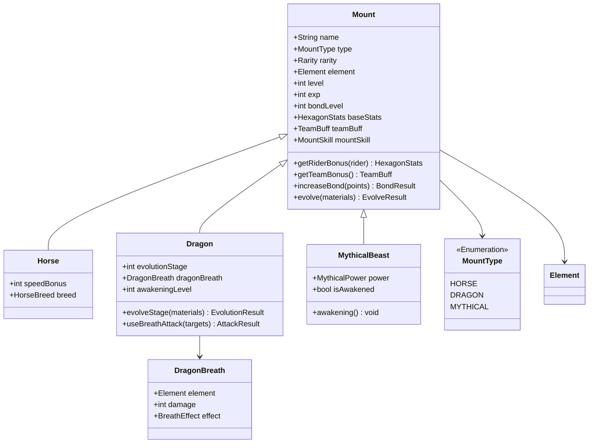

## 6. Sequence Diagram - Battle Turn

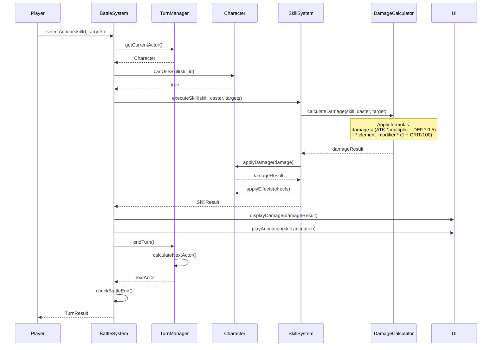

## 7. Sequence Diagram - Gacha Pull

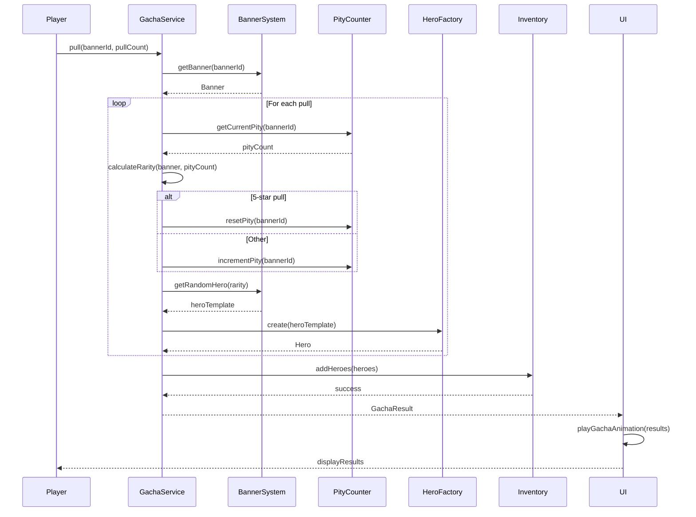

## 8. State Diagram - Boss Phases

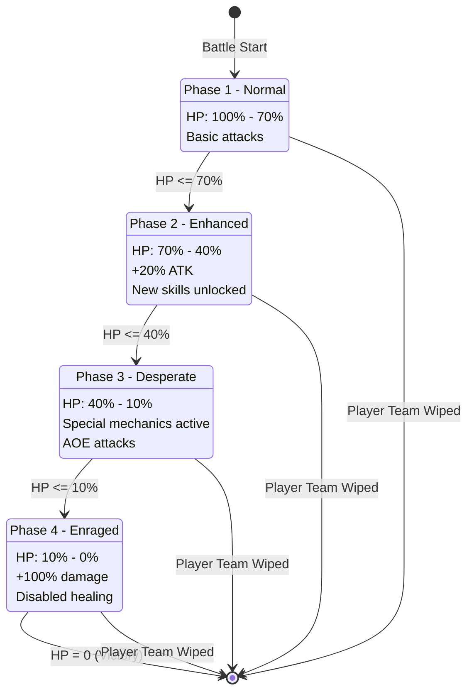

## 9. State Diagram - Character States

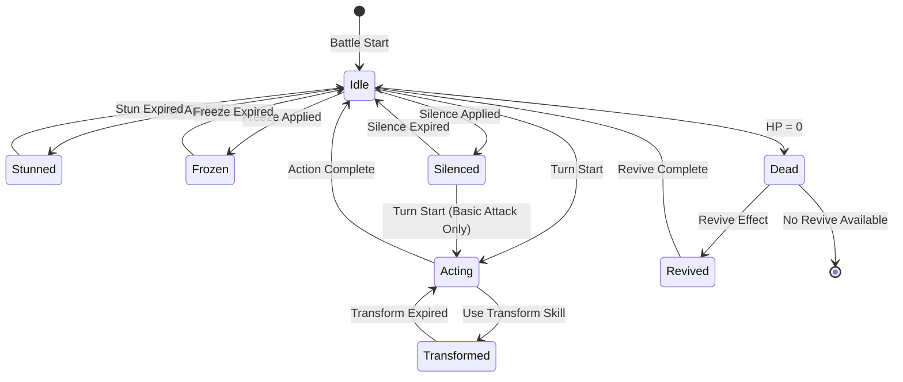

## 10. Component Diagram - System Architecture

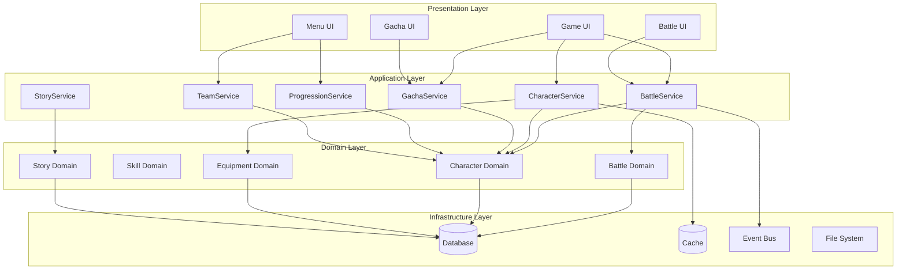

## 11. ER Diagram - Database Relationships

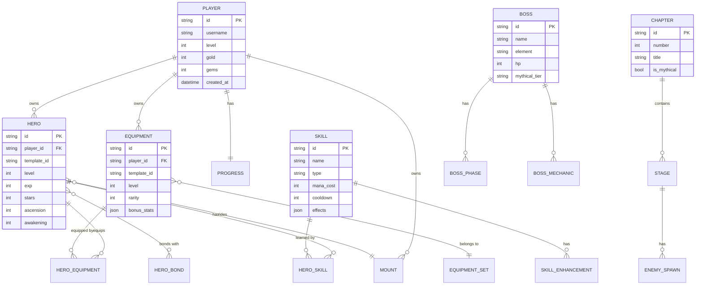

## 12. Activity Diagram - Story Progression

```mermaid
flowchart TD
    Start([Start Game]) --> Tutorial[Complete Tutorial]
    Tutorial --> Chapter1[Chapter 1: Khởi Nguồn]
    
    Chapter1 --> |Clear all stages| Boss1{Defeat Trương Giác}
    Boss1 --> |Victory| Unlock1[Unlock: Lưu Bị, Quan Vũ, Trương Phi]
    Boss1 --> |Defeat| Retry1[Retry or Level Up]
    Retry1 --> Boss1
    
    Unlock1 --> Chapter2[Chapter 2: Quần Hùng Tụ Nghĩa]
    Chapter2 --> |Clear all stages| Boss2{Defeat Lã Bố}
    Boss2 --> |Victory| Unlock2[Unlock: Tào Tháo, Tôn Kiên + Xích Thố]
    Boss2 --> |Defeat| Retry2[Retry or Level Up]
    Retry2 --> Boss2
    
    Unlock2 --> Chapter3[Chapter 3: Tam Phân Thiên Hạ]
    Chapter3 --> Boss3{Defeat Hạ Hầu Đôn}
    Boss3 --> |Victory| Unlock3[Unlock: Gia Cát Lượng, Triệu Vân]
    
    Unlock3 --> Chapter4[Chapter 4: Xích Bích Đại Chiến]
    Chapter4 --> Boss4{Defeat Tào Tháo}
    Boss4 --> |Victory| Unlock4[Unlock: Chu Du, Hoàng Cái, Lục Tốn]
    
    Unlock4 --> Chapter5[Chapter 5: Bắc Phạt Trung Nguyên]
    Chapter5 --> Boss5{Defeat Tư Mã Ý}
    Boss5 --> |Victory| Unlock5[Unlock: Khương Duy, Mã Siêu, Hoàng Trung]
    
    Unlock5 --> Chapter6[Chapter 6: Loạn Thế Chung Cục]
    Chapter6 --> Boss6{Defeat Tư Mã Viêm}
    Boss6 --> |Victory| SecretPath[Secret Path Unlocked]
    
    SecretPath --> |Level 80+, 5x 5★ Heroes| MythicalChapter[Chapter 7: Thiên Giới Đại Chiến]
    
    MythicalChapter --> TuLinh[Stage 1: Tứ Linh Thần Thú]
    TuLinh --> |Defeat all 4| ThienVuong[Stage 2: Tứ Đại Thiên Vương]
    ThienVuong --> |Defeat all 4| ThuongCo[Stage 3: Thượng Cổ Thần Ma]
    ThuongCo --> |Defeat all 3| FinalBoss{Final Boss: Hỗn Độn}
    
    FinalBoss --> |Victory| Ending([Game Complete: Thiên Hạ Vô Song])
    FinalBoss --> |Defeat| RetryFinal[Retry with better team]
    RetryFinal --> FinalBoss
```

---

## Diagram Legend

| Symbol | Meaning |
|--------|---------|
| `<<abstract>>` | Abstract class |
| `<<Enumeration>>` | Enum type |
| `<<ValueObject>>` | Immutable value object |
| `+` | Public |
| `-` | Private |
| `#` | Protected |
| `-->` | Association |
| `<\|--` | Inheritance |
| `*-->` | Composition |
| `o-->` | Aggregation |

---

*Các diagram này được viết bằng Mermaid syntax và có thể render trực tiếp trong GitHub, GitLab, hoặc các công cụ hỗ trợ Mermaid.*
